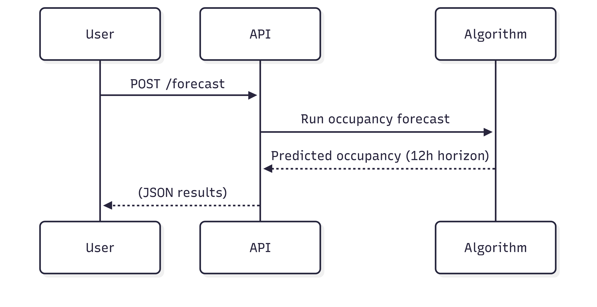

# 🔌 PlugPredict: Occupancy Forecasting with Logistic Regression

**PlugPredict** is a Python tool for forecasting occupancy in EV charging stations (or similar plug-in resources).  
It uses historical binary occupancy data (`0 = free`, `1 = occupied`) stored in `.txt` files and trains a logistic regression model (NumPy-only, no scikit-learn).  
Predictions are generated for the next **12 hours** at **5-minute intervals**, and results are saved as `.json` files.

---

## 📌 Features

- ✅ Logistic regression implemented **from scratch** with NumPy  
- ✅ Reads historical occupancy data from `.txt` logs  
- ✅ Trains on all available history  
- ✅ Forecasts 12 hours ahead (144 × 5‑minute steps)  
- ✅ Outputs results as `.json` (timestamp + predicted state)  
- ✅ Fully configurable using **environment variables**  

---


## ⚡ Workflow



---

## 📁 File Structure

```
PlugPredict/
├── PlugPredict.py        # Main script
├── README.md             # Documentation
├── database/             # Folder with historical .txt files
└── json/                 # Folder where predictions are saved
```

---

## 📊 Input File Format

### TXT (Historical Occupancy Data)
- Format:  
  ```
  YYYY-MM-DD HH:MM:SS 	 0_or_1
  ```
- Example:
  ```
  2025-09-18 08:00:00    0
  2025-09-18 08:05:00    1
  2025-09-18 08:10:00    1
  ```
- Must be continuous in **5-minute resolution**. Missing timestamps are automatically filled with `0`.

### JSON (Forecast Output)
After running the script, predictions are saved as JSON with structure:
```json
[
  {"timestamp": "2025-09-19 08:05:00", "value": 1},
  {"timestamp": "2025-09-19 08:10:00", "value": 0}
]
```

---

## ⚙️ Environment Variables

PlugPredict requires two environment variables to be set:

- `INPUT_FOLDER` → Path to folder containing `.txt` history files  
- `OUTPUT_FOLDER` → Path to folder where `.json` predictions will be written  

### Example

#### PowerShell (Windows)
```powershell
$env:INPUT_FOLDER="C:/Users/You/database"
$env:OUTPUT_FOLDER="C:/Users/You/json"
python PlugPredict.py
```

#### Bash (Linux/macOS)
```bash
export INPUT_FOLDER="/home/you/database"
export OUTPUT_FOLDER="/home/you/json"
python PlugPredict.py
```

If variables are missing, the script will exit with an error message.

---

## 🚀 How It Works

1. Loads all `.txt` occupancy logs from `INPUT_FOLDER`  
2. Converts timestamps into **cyclical features**: hour, minute, day of week, weekend indicator  
3. Trains a logistic regression model (gradient descent + optional L2 regularization)  
4. Generates predictions for the next **12 hours** at **5-minute intervals**  
5. Saves results to `OUTPUT_FOLDER` as `.json`  

---

## ✅ Requirements

- Python 3.7+  
- NumPy  
- Pandas  

Install dependencies:
```bash
pip install numpy pandas
```

---

## 📤 Example Output

```
[OK] Saved forecast to: json/station1_pred.json
```

JSON file will look like:
```json
[
  {"timestamp": "2025-09-19 08:05:00", "value": 1},
  {"timestamp": "2025-09-19 08:10:00", "value": 0},
  {"timestamp": "2025-09-19 08:15:00", "value": 0}
]
```

---

## 📚 Customization

- Change forecast horizon (default = 12h) by modifying `periods=144` in the code  
- Adjust probability threshold (default = 0.6) for binary classification  
- Add new time-based features for richer predictions  

---

## 📜 License


---

## ✉️ Contact

**José P. Sousa**  
📧 jose.p.sousa@inesctec.pt  
🏢 INESC TEC